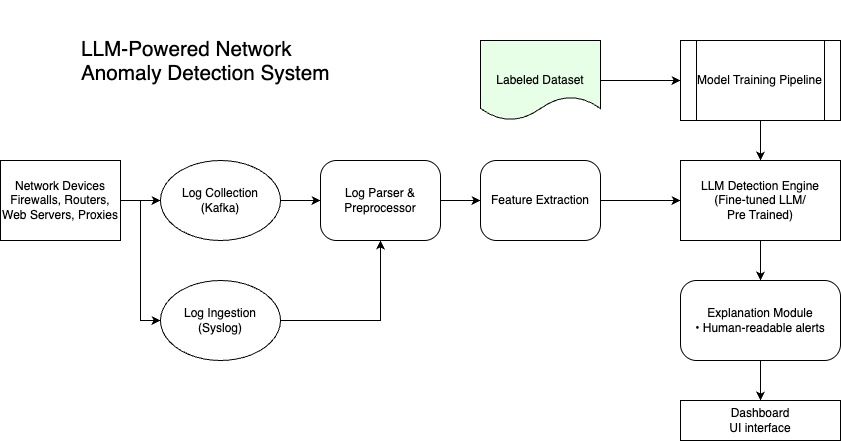

# LLM-Powered Network Anomaly Detection System



A machine learning system for real-time network anomaly detection using fine-tuned FLAN-T5 model, aligned with BRD requirements for enterprise network monitoring.

## 📋 Project Overview
This system implements the specifications from the [Business Requirements Document (BRD)](docs/HP_BRD.pdf) to:
- Automatically detect unusual patterns in network logs
- Process 2.8M+ records with 30%+ productivity improvement for IT teams
- Provide real-time analysis and visualizations of anomalies
- Support proactive network management through AI-driven insights

## 🛠️ Setup Instructions

### Clone Repository
```
git clone https://github.com/rajkadakia/network-anomaly-detection.git
cd network-anomaly-detection
```

### Handle Large Files
**Due to Git LFS limitations:**
```
# Download dataset manually
wget https://www.unb.ca/cic/datasets/ids-2017.html -O CIC-IDS2017.zip

# Create dataset directory
mkdir -p CIC-IDS2017
unzip CIC-IDS2017.zip -d CIC-IDS2017/
```

### Install Requirements
```
pip install -r requirements.txt
```

### Prepare Training Dataset
```
# Generate processed dataset
python3 scripts/historical_data.py
```

## 🔧 Model Setup

### Download Base Model
```
from transformers import AutoTokenizer, AutoModelForSeq2SeqLM

model_name = "google/flan-t5-base"

# Download and cache locally
tokenizer = AutoTokenizer.from_pretrained(model_name)
model = AutoModelForSeq2SeqLM.from_pretrained(model_name)

# Save for offline use
model.save_pretrained("/models/flan-t5-base")
tokenizer.save_pretrained("/models/flan-t5-base")
```

## 🚀 Training Pipeline
### Full Dataset Training
```
python3 scripts/fine_tune_model.py
```

### Reduced Dataset Training
```
python3 scripts/fine_tune_reduced.py
```

## 🖥️ Usage
```
# Start real-time inference engine
python3 scripts/inference.py
```

## 📚 References
- [BRD Documentation](docs/HP_BRD.pdf)
- [Project Architecture](docs/Functional_Diagram.jpg)
- [CIC-IDS2017 Dataset](https://www.unb.ca/cic/datasets/ids-2017.html)
- [FLAN-T5 Paper](https://arxiv.org/abs/2210.11416)
